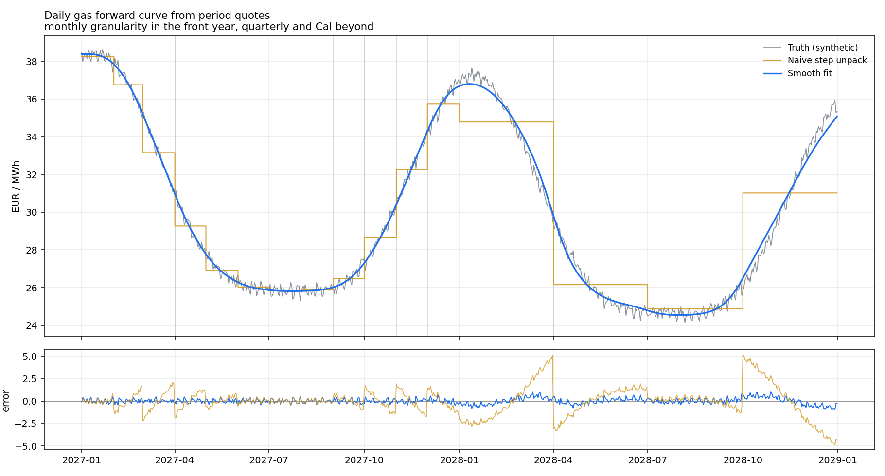
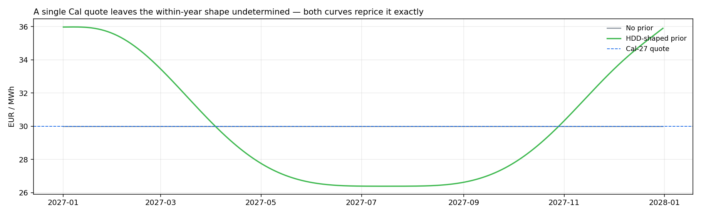
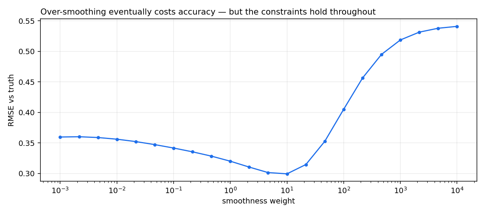

# 01 — Gas Forward Curve Construction

**How do you turn monthly, quarterly and Cal-year quotes into a daily forward curve that reprices every quoted product exactly, without inventing structure the market never said anything about?**

---

## Why this is the first project

Nothing else in commodities works without it. Storage optimisation needs a price for each injection and withdrawal day. Swing valuation needs a daily strike reference. Spark spreads need gas and power on the same daily grid. PnL attribution needs yesterday's curve and today's on comparable footing. Every one of those models silently inherits whatever the curve builder did.

It is also the point where commodities stop resembling other asset classes. An equity forward is a price at a date. A gas forward is a price for *delivery over a window* — and the market only quotes some windows, with liquidity thinning as you go out.

## The problem

The screen shows roughly this:

| Product | Granularity |
|---|---|
| Jan-27 … Dec-27 | monthly, liquid |
| Q1-28 … Q4-28 | quarterly |
| Cal-28 | annual |

We need 731 daily prices from 17 numbers. The system is massively underdetermined, and two requirements pull against each other.

**Reconstitution (hard constraint).** Averaging the fitted daily curve over any quoted window must return that window's quote:

$$A f = q$$

where $f \in \mathbb{R}^{731}$ is the daily curve and each row of $A$ holds the delivery-day weights of one product. Violating this means the curve is arbitrageable against the very instruments it was built from — and every delta computed off it is misallocated.

**Plausible shape (soft preference).** Infinitely many curves satisfy the constraint. The naive choice — flat within each product — is the one most desks reach for, and it is bad in a specific way: it places discontinuous jumps at exactly the month boundaries where storage and swing optionality is valued, so it manufactures spread value that does not exist.

## The method

Follow Fleten & Lemming (2003): keep reconstitution as a hard equality constraint and choose among feasible curves by penalising roughness and deviation from a prior shape.

$$\min_{f} \; w_s \lVert f - s \rVert^2 + w_r \lVert D_2 f \rVert^2 \quad \text{s.t.} \quad A f = q$$

$D_2$ is the second-difference operator. Penalising **curvature rather than slope** matters: a first-difference penalty would fight the genuine seasonal trend, whereas curvature is zero for any straight line, so real trends pass through untouched while artificial boundary kinks do not.

$s$ is the prior shape — a stylised HDD sinusoid with a second harmonic to sharpen the winter peak, plus a small weekend discount. It is re-centred additively on the mean quote, so only its *deviations* enter and its arbitrary absolute level cannot leak into the fit (there is a test for this; the first implementation rescaled multiplicatively and failed it).

### One implementation note that mattered

The obvious route is to assemble the KKT system and solve it in one shot. That mixes two badly-scaled blocks — curvature entries of order $w_r$ against averaging weights of order $1/31$ — and cost several digits: reconstitution error came out at $2.8\times10^{-4}$ even on exact inputs.

Reducing to the null space of $A$ instead:

$$f = f_p + Zy, \quad AZ = 0 \quad \Longrightarrow \quad (Z'HZ)\,y = Z'(g - Hf_p)$$

the constraints hold by construction and only the well-conditioned objective is solved numerically. Error dropped to $1.4\times10^{-14}$ — machine precision.

## Results

Synthetic truth: an annual heating cycle, mild backwardation, a weekend effect, and daily noise. Quotes are averaged from it at the granularity ladder above and rounded to three decimals.



| | RMSE vs truth |
|---|---|
| Naive step unpack | 1.5618 |
| **Smooth fit** | **0.3200** |

A **4.9×** reduction in error, concentrated exactly where it matters: the step curve is worst at product boundaries and in the second year where only quarterly quotes exist, with errors reaching ±5 EUR/MWh. Those are the boundaries a calendar spread trades across.

### Reconstitution error is inherited, not generated

| Quote rounding | Max reconstitution error | Worst input inconsistency |
|---|---|---|
| none (exact) | 1.4e-14 | 0 |
| 3 dp | 2.8e-04 | 3.5e-04 |
| 2 dp | 4.8e-04 | 6.0e-04 |
| 1 dp | 1.4e-02 | 1.8e-02 |

The residual error is not solver noise. Cal-28 is quoted as a rounded number, and so are the four quarters inside it — so the two disagree by up to half a tick and the constraint set is *genuinely* infeasible. The fit distributes that inconsistency rather than hiding it, and the error never exceeds the input inconsistency that caused it.

The practical consequence: `check_quote_consistency()` should run before every build, with a tolerance scaled to the tick size, not to machine epsilon. A flagged inconsistency far above half a tick is a stale quote or a bad feed — occasionally a real calendar arbitrage, but that is the rarer explanation.

### What the prior actually buys



Given only Cal-27, smoothness alone returns a flat line — mathematically defensible, commercially absurd, since it prices January gas equal to July gas. The prior supplies the seasonality the quotes are silent on, while the annual average still reprices to the quote exactly. **This is the honest framing: on the far curve the shape is an assumption, not a market observation, and it should be labelled as such in any risk report built on it.**

### Choosing the smoothing weight



RMSE is flat-bottomed between roughly $w_r = 1$ and $50$, optimal near $10$, and degrades beyond $100$ as the fit over-smooths the seasonal peak. Reconstitution holds to the same tolerance across seven orders of magnitude — the constraint does not care how the objective is weighted, which is the point of imposing it hard.

## Limitations

- **The prior is stylised, not estimated.** A production build would fit the shape to historical settlements or a normalised HDD forecast. As it stands, far-curve seasonality is my assumption wearing the curve's clothing.
- **Synthetic truth flatters the method.** The generator is smooth-plus-noise, which is exactly what a curvature penalty is designed to recover. Real curves have structural breaks — a storage auction, an outage, an LNG cargo diversion — that a global smoothness penalty will smear across the break.
- **Bid–ask is ignored.** Fleten & Lemming actually impose quotes as *bounds*, not equalities, which is more honest for illiquid far-curve products where the spread is wide. Equality constraints treat a two-way price with a 50-cent spread as a point observation.
- **No day-of-week estimation.** The weekend discount is hard-coded. In power it is far larger and genuinely worth estimating.
- **Baseload only.** Power needs peak/off-peak shaping within the day; `period_weight_matrix` accepts hourly weights for this, but no project uses it yet.

## Next steps

Bounds instead of equalities would be the single highest-value extension — it turns the QP into an inequality-constrained problem needing a real solver, but removes the pretence that an illiquid Cal quote is a point. After that, an empirically estimated shape prior, and hourly power shaping.

## Reproduce

```bash
cd projects/01-gas-forward-curve-construction
python run_analysis.py          # regenerates every figure and table above
pytest tests/ -v                # 22 tests
```

## Reference

Fleten, S.-E. and Lemming, J. (2003). *Constructing forward price curves in electricity markets.* Energy Economics 25(5), 409–424.
